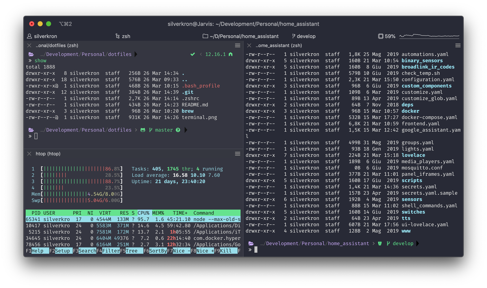

# My personal Dotfiles

This is my personal environment configuration for backup purposes. I will update this files with all configurations, but Brewfile is the most important at the moment.

## Setup

### Install packages

Use `brew bundle install` into the brew directory to install all packages and apps

### Setup font and color schema

Manually install the terminal font and color schema on iTerm2.
